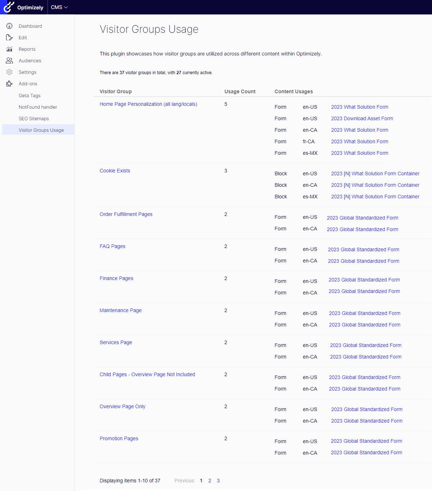

# A2Z.VisitorGroupsUsage
The **A2Z.VisitorGroupsUsage** is a freely available module. If you find it beneficial, you can show your support by treating me to a coffee on [Ko-fi](https://ko-fi.com/U7U2STV29):

[](https://ko-fi.com/U7U2STV29)

## Description
[](https://docs.microsoft.com/en-us/dotnet/)
[](https://docs.microsoft.com/en-us/dotnet/)
[](http://world.episerver.com/cms/)
[](http://world.episerver.com/cms/)

This add-on provides comprehensive insights into the usage and effectiveness of visitor groups within Optimizely CMS. Editors  can track and analyze how different visitor groups interact with site content, enabling more informed decision-making and targeted content strategies.

## Installation

The command below will install the addon in your Optimizely project.

```
dotnet add package A2Z.VisitorGroupsUsage
```

## Usage

To access the add-on, go to `Add-ons -> Visitor Groups Usage`



## Contributing

Feel free to submit a pull request if you identify any areas that could be enhanced or improved.

## Feature Requests

If you have new ideas or feature requests that can make this tool even more useful for you or the community, please feel free to open a new issue at the following link.

https://github.com/adnanzameer/optimizely-visitor-groups-usage/issues

## Changelog

[Changelog](CHANGELOG.md)